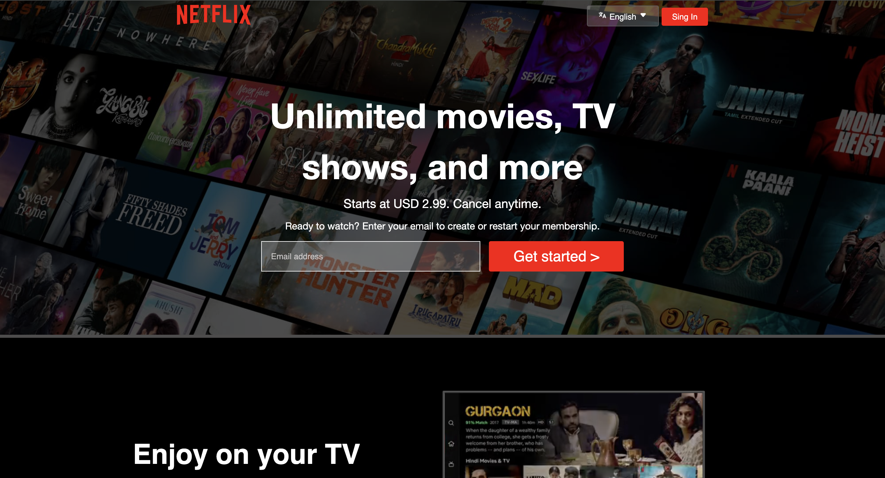

# Netflix Clone 🎬

A responsive Netflix landing page clone tailored for Bangladesh, featuring dynamic content sections and mobile-friendly design.



## Features ✨

- Netflix-style hero section with email signup
- Device compatibility showcase sections
- Interactive FAQ accordion
- Responsive design with mobile optimization
- Footer with grid-based navigation links
- Authentic Netflix UI elements and styling
- Localized content for Bangladesh
- SVG icon integration
- Background video embeds

## Technologies Used 💻

- **HTML5** semantic markup
- **CSS3** (Flexbox, Grid, Media Queries)
- **Responsive Design** principles
- **CSS Variables** for theme management
- **SVG** icons and graphics
- Google Fonts integration

## Installation 🛠️

1. Clone repository:
   ```bash
   git clone https://github.com/MohammadAtifHossain/netflix-clone.git


This README includes:
1. Project-specific features
2. Asset structure requirements
3. Customization guide for key elements
4. Responsive design documentation
5. Clear next steps for completion
6. Localization details for Bangladesh

Remember to:
1. Add actual screenshot named `screenshot.png` in assets
2. Complete responsive implementation
3. Add FAQ JavaScript functionality
4. Replace all placeholder links
5. Optimize media assets for production
6. Add proper licensing for any third-party assets
